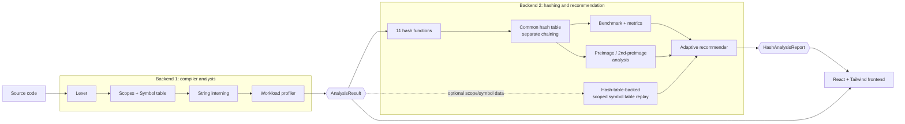

# HashSense: Pipeline & Backend 2 Documentation

HashSense studies which hash function suits a compiler's symbol table for a
*specific* program, instead of assuming one function is best for everything.

## 1. End-to-end pipeline



Plain-text version:

```
Source Code -> Lexer -> Scope/Symbol Table -> String Interning -> Workload Profiler
                                                                      |
                                                             AnalysisResult   (Backend 1 output)
                                                                      |
   Hash functions (11) -> Common hash table -> Benchmark & metrics ---+
                                |                                     |
                                +-> Scoped symbol-table replay -------+--> Adaptive recommender
                                +-> Preimage / 2nd-preimage analysis -+          |
                                                                          HashAnalysisReport -> Frontend
```

## 2. The contract between Backend 1 and Backend 2

Backend 2 never imports Backend 1's classes. It reads attributes through the
structural interface in `src/hashing/interfaces.py`.

| Needed from `AnalysisResult` | Used for | Required? |
|---|---|---|
| `identifier_stream` | the benchmark workload (insert unique, look up every occurrence) | yes |
| `workload_metrics` (`identifier_frequency`, `repetition_ratio`, `uniqueness_ratio`, `total/unique_identifiers`, ...) | real access frequencies, adaptive weights, confidence | yes |
| `interned_identifiers` | part of the agreed contract | yes |
| `symbol_table.symbols` (`name`, `scope_id`, `role.name`) and `scopes` (`parent_id`) | replaying real declare/resolve traffic through the hash-based symbol table | optional: stage skipped if absent |

Only `src/hashing/adapters.py` knows the shape of Backend 1's symbol/scope
data, so a Backend 1 refactor touches one file.

## 3. Hash functions

All are pure Python, 32-bit, deterministic, and independent of Python's salted
`hash()`. Pure Python is deliberate: no function gets a native-C speed
advantage (e.g. `zlib`), so timings compare algorithms on equal footing.

| Name | Family | Notes |
|---|---|---|
| DJB2 | Classic | `h = h*33 + c` |
| FNV-1a | Classic | XOR, then multiply |
| SDBM | Classic | `h = c + (h<<6) + (h<<16) - h` |
| Jenkins (one-at-a-time) | Classic | add/shift/xor with final avalanche |
| CRC32 | Checksum | IEEE table-driven; verified against `zlib.crc32` |
| FNV-1 | Classic | multiply, then XOR |
| MurmurHash3 | Modern | x86_32; verified against `mmh3` |
| xxHash32 | Modern | verified against `xxhash` |
| Adler-32 | Checksum | verified against `zlib.adler32`; weak on short strings |
| Linux dcache | Kernel | `partial_name_hash` (`(h + (c<<4) + (c>>4)) * 11`) + golden-ratio finalizer `0x9E3779B1` |
| Lose-lose (baseline) | Baseline | sum of characters; deliberately bad, ranked but never recommended |

## 4. Definition of a collision

Two different notions are used, and every report states which one a number refers to.

* **Full-hash collision**: two distinct identifiers `a != b` with `h(a) == h(b)`
  (the whole 32-bit value is equal). A property of the hash function alone; no
  table size can avoid it.
* **Bucket collision**: two distinct identifiers `a != b` with
  `h(a) mod m == h(b) mod m` in a table of `m` buckets. Depends on the hash
  function *and* the table size, and is the one that slows a symbol table down.
  * `collisions` = number of insertions of a new identifier into an
    already-occupied bucket.
  * `colliding_pairs` = number of unordered pairs sharing a bucket
    (sum of C(chain length, 2)); it grows quadratically with long chains.

Every full-hash collision is also a bucket collision, never the reverse.
Collisions are resolved by **separate chaining**: each bucket holds a list.
The same definitions are shipped in the report (`definitions`) for the frontend.

## 5. Metrics

| Metric | Meaning | Ideal |
|---|---|---|
| `insert_time_sec`, `lookup_time_sec` | best of several runs; insert over unique identifiers, lookup over the full stream | lower |
| `hash_only_ns_per_key` | cost of the hash function alone | lower |
| `collisions`, `full_hash_collisions`, `colliding_pairs` | see section 4 | lower |
| `collision_ratio_vs_ideal` | `colliding_pairs / (n(n-1)/2m)` | about 1.0 |
| `load_factor` | `n / m` | target 0.75 |
| `max_chain_length`, `avg_chain_length_nonempty`, `stddev_chain_length` | bucket/chain distribution (full histogram in `bucket_distribution`) | low |
| `empty_bucket_ratio` vs `expected_empty_bucket_ratio` | compare with the random-hash value `exp(-n/m)` | close |
| `chi_square_normalized` | chi-square of chain lengths / (m-1) | about 1.0 |
| `weighted_avg_probes` | comparisons per lookup under the program's *real* identifier frequencies; deterministic | lower |
| `avalanche_quality` | flip one input bit, see which output bits change | 1.0 |
| `estimated_memory_bytes` | `sys.getsizeof` estimate; nearly equal across functions | informational |
| `symbol_table.*` | declare/resolve replay: scope hops, comparisons, collisions, time | lower |

## 6. Symbol table built on the hash table

`src/hashing/symbol_table_hashed.py` implements a scoped symbol table the way
a real compiler does:

* each lexical scope owns a `HashTable` keyed by identifier name;
* scopes are linked to their parent;
* `resolve(name)` searches the current scope, then walks outward, so inner
  declarations **shadow** outer ones;
* `declare` rejects a redeclaration in the same scope.

Backend 1's `SymbolTable` stays the analysis artefact and is not modified. The
benchmark *replays* Backend 1's recorded declaration/reference events, in
source order, through this structure once per hash function and reports
scope hops, key comparisons, collisions and time. This judges each function on
its real job (declare and resolve) rather than bulk insert only. References
with no visible declaration (for example library calls) are counted as
`unresolved`.

## 7. Preimage and second-preimage resistance

| Property | Definition |
|---|---|
| Collision resistance | infeasible to find any `x != y` with `h(x) = h(y)` |
| Preimage resistance | given only a digest `d`, infeasible to find any `y` with `h(y) = d` |
| Second-preimage resistance | given `x`, infeasible to find `y != x` with `h(y) = h(x)` |

**None of the functions is cryptographic**, so none is designed to have these
properties; a symbol table only needs good distribution. They matter here
because hostile or machine-generated source can exploit a weak hash to force
many identifiers into one chain (hash flooding), degrading lookups from O(1)
towards O(n). `src/hashing/security.py` measures two things:

1. **Brute-force effort on a truncated digest** (default 10 bits, 24 targets).
   Preimage = blind random search for any identifier with the target digest;
   second preimage = the same, but the original identifier is known and must
   be avoided. `effort_ratio = mean trials / 2^bits`; about 1.0 means "no
   better than brute force". Sampling error is roughly 20%, so ratios between
   about 0.6 and 1.5 are indistinguishable from 1.0. SHA-256 truncated the same
   way is reported as `security_reference`.
2. **Bounded structural second-preimage search on the full 32-bit digest**:
   transpositions and adjacent-pair edits of real identifiers. A hit is a
   concrete, checkable weakness. Measured on 150 realistic identifiers:

   | Function | Identifiers with a full-digest second preimage found |
   |---|---|
   | DJB2 | 150 / 150 (bump a character by +1 and lower its neighbour by 33, so `"ez"` and `"fY"` collide) |
   | Lose-lose | 150 / 150 (any transposition) |
   | Linux dcache | 134 / 150 |
   | FNV-1, FNV-1a, SDBM, Jenkins, CRC32, Murmur3, xxHash32, Adler-32 | 0 / 150 |

   *Finding nothing is not a proof of resistance*; it only means this bounded
   search found no shortcut.

If the recommended function has a structural weakness, the report says so.

## 8. Adaptive recommendation

Score (lower is better) = weighted sum of min-max-normalised criteria: insert
time, lookup time, weighted probes, colliding pairs, full-hash collisions,
avalanche shortfall, memory, plus symbol-table replay time when available.
Differences inside measurement noise are treated as ties.

Weights adapt to `workload_metrics`:

| Workload | Emphasis |
|---|---|
| `repetition_ratio >= 0.6` | lookup time and probes |
| `uniqueness_ratio >= 0.8` and `>= 200` identifiers | collision criteria |
| otherwise | balanced |

Baselines are ranked but never recommended. `confidence` is `low` below 50
unique identifiers, `medium` below 200, else `high`; on small programs the
functions are statistically indistinguishable and the report says so.

## 9. Output for the frontend (`HashAnalysisReport`)

`dataclasses.asdict(report)` gives JSON with:

* `per_function[]`: all section 5 metrics per hash function, plus `security`
  and `symbol_table` sub-objects
* `ranking[]`: `name`, `rank`, `score`, `eligible`, per-criterion `breakdown`
* `recommended_function`, `recommendation_reason`
* `weights` (what was emphasised), `confidence`
* `security_reference` (SHA-256 baseline), `definitions` (text for tooltips)
* `workload_summary`

New fields were added after the original contract and all have defaults, so
existing consumers keep working.

## 10. Known limitations

* **Timings are pure-Python timings.** They reflect interpreter operations per
  key, not native speed: xxHash and Murmur look slower than they are in C, and
  trivial functions look faster. Collision, probe, distribution and avalanche
  metrics are implementation-independent and deterministic.
* Small programs (tens of identifiers) cannot separate the functions; see `confidence`.
* The truncated brute-force numbers are relative indicators, not security proofs.
* Memory is an estimate with little variation between functions.

## 11. Running the tests

```
pip install -e ".[dev]"
pytest
```
